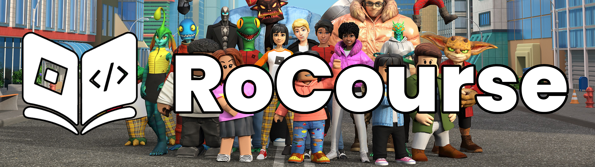

# RoCourse

**Learn Luau by building real Roblox games — one tiny step at a time.**

RoCourse is a free, interactive course that treats you like a builder, not a
spectator. No copy-paste tutorials, no walls of theory. You assemble real game
code yourself, one short step at a time, and the course only moves forward when
you actually solve each activity.

**Free forever. No paywall, no sign-up wall, no tricks.** All lessons, every
activity type, and the full Luau playground work without an account. Accounts
are optional and exist purely to sync your progress across devices.

> Built with AI, reviewed by a human. The course is developed with AI
> assistance to stay free and open — and every lesson, activity, and feature is
> then reviewed and managed by a human before it ships.

## Why you'll actually finish

- **Micro-lessons, not lectures.** Every lesson is a chain of tiny steps: a
  concept, a tiny example, one activity. You're never more than a minute from
  the next win.
- **Solved-activity gating.** Lessons lock in order — the next step unlocks only
  when you've solved the current one. No skipping ahead, no fake progress.
- **Autosaved progress.** Everything saves as you go, and it syncs to the cloud
  the moment you sign in.

## What's inside

- **91 lessons across two complete games** — a Coin Tycoon and a collection
  game — covering real Roblox Studio workflows and Luau fundamentals.
- **Eight activity types** that make you write, predict, fix, and arrange real
  code: multiple choice, fill-in-the-blank, write-the-code, predict-the-output,
  fix-the-bug, arrange-the-code, run-the-code, and choose-your-build.
- **A live Luau playground** running in your browser, so you can experiment
  anywhere in the course.
- **Daily challenges and a final certificate** to keep your streak alive and
  celebrate the finish line.
- **A 60-second drill** — a timed sprint through harder Luau questions, with
  your best score saved to your profile.
- **XP and levels** — lessons, quizzes, daily challenges, and drills all earn
  XP, and a weekly leaderboard ranks the top earners (guests included).
- **A Luau reference and a weekly XP leaderboard** — look anything up, or see
  who earned the most XP this week. Signed-in learners can share a public
  progress profile (never your email).
- **Inline glossary popovers** — hover any key term in a lesson (part,
  workspace, tween, event, …) for a one-line definition and a link to the
  lesson that teaches it.
- **Optional cloud sync** so your progress follows you across devices.
- **English and Spanish.** Every screen is localized — the interface, all
  guides, the FAQ, and the full interactive content (every quiz question,
  daily challenge, and reference entry). English lives at the root URL;
  Spanish is served at `/es`.

## How the course works

- Lessons are a chain of short **steps** — a concept, a tiny example, often one
  activity. You never face a wall of text.
- Every step's activity must be **solved** before the next unlocks. Progress is
  saved as you go, so you always pick up where you left off.
- Lessons are organized into **sections** that build on each other, from your
  first script all the way to publishing a finished game.
- You can **experiment freely** in the built-in Luau playground at any point in
  the course, or look up any concept in the Luau reference.

## For learners

- **Everyone starts free.** The whole course is playable with no account, and
  your progress is saved locally on your device.
- **Sign in to sync.** Create a free account to carry your progress across
  devices and appear on the public leaderboard and showcase.
- **Privacy by default.** Public profiles are opt-in, and your email is never
  shown publicly.
- **Be seen.** Finish the course and you're added to the learner showcase —
  nothing to sign up for beyond your free account.
- **Get help.** A community library of Roblox/Luau assets on the resources page
  is hand-vetted and added to only after a human review.

## New to Luau or Roblox?

If you're brand new, start at the very beginning — the first section assumes
nothing and walks you through opening Roblox Studio and writing your very first
script. No prior coding experience needed.

## License

RoCourse is source-available under the
[PolyForm Strict License 1.0.0](./LICENSE).

Plainly: the source is fully public on GitHub, and you're welcome to read it,
run it, and learn from it for any noncommercial purpose. What the license
protects is the work itself — you may **not** redistribute the code or build
derivative versions of it (including the course content) as your own, and
commercial use requires permission. It's open eyes, not open season.
